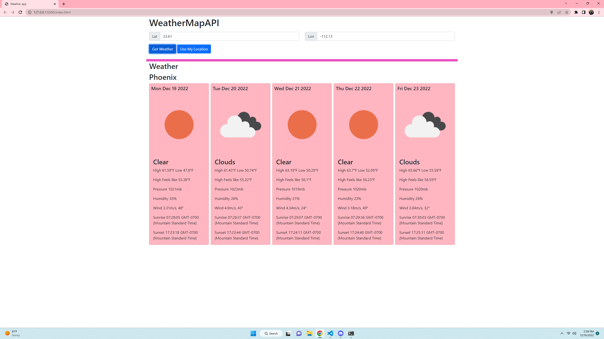

# API from api.openweathermap.org
# wanted to go based of latitude and longitude 
# also wanted to display city name after typing in lat and lon 
# wanted a 5 day forcast
# wanted it to store data in local storage 
# had to set two api keys to get the city to display along with the api api for lat and long 
# wanted a pink color for the boxes 
# wanted units to be displayed in Fahrenheit
# needed to use Jqury to link lat and long 
# used open weather map.org for images on the page 
# added set value location for tucson az 
# also added current location button to display based of current location